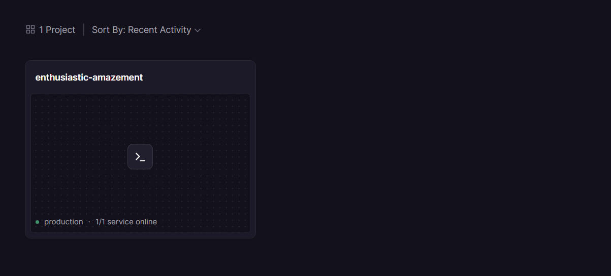

# Day 12 Lab - Mission Answers

> **Student Name:** Bùi Minh Đức  
> **Student ID:** 2A202600005  
> **Date:** 17/04/2026

---

## Part 1: Localhost vs Production

### Exercise 1.1: Anti-patterns found

1. **Không có error handling** — Không có `try/except` quanh LLM call. Nếu service lỗi sẽ trả về HTTP 500 với stack trace thô, lộ thông tin nội bộ cho client.
   ```python
   response = ask(question)
   ```

2. **Nhận `question` qua query parameter thay vì request body** — FastAPI hiểu `question: str` trong hàm POST là query param (`/ask?question=...`). Câu hỏi bị ghi vào URL, server log, browser history — vi phạm bảo mật.
   ```python
   def ask_agent(question: str):
   ```

3. **Không validate input** — Không kiểm tra `question` có rỗng không, không giới hạn độ dài. Dễ bị abuse, gửi câu hỏi cực dài để tốn token/tiền.

4. **Không có CORS configuration** — Không set CORS middleware, không kiểm soát được domain nào được phép gọi API.

5. **`import os` nhưng không dùng** — Import thừa, cho thấy không có ý định đọc environment variables ở bất kỳ đâu trong file.
   ```python
   import os
   ```

---

### Exercise 1.2: Production fixes

Các thay đổi chính trong `production/app.py`:

- Bọc LLM call trong `try/except`, raise `HTTPException` với message rõ ràng thay vì để lộ stack trace
- Chuyển `question` vào Pydantic request body (`class AskRequest(BaseModel)`)
- Thêm validation: kiểm tra rỗng, giới hạn độ dài tối đa
- Thêm `CORSMiddleware` với `allowed_origins` từ env var
- Đọc toàn bộ config từ `config.py` — không hardcode bất kỳ giá trị nào

---

### Exercise 1.3: Comparison table

| Feature | Develop | Production | Why Important? |
|---------|---------|------------|----------------|
| Config | Hardcode trong code | Đọc từ env vars qua `config.py` | Thay đổi config không cần sửa code, bảo mật secrets |
| Secrets | `OPENAI_API_KEY = "sk-..."` | `os.getenv("OPENAI_API_KEY")` | Tránh lộ key khi push code lên GitHub |
| Logging | `print()` + log ra secret | Structured JSON logging, không log secret | Dễ parse, tích hợp log aggregator (Datadog, Loki) |
| Health check | Không có | `/health` (liveness) + `/ready` (readiness) | Platform tự restart khi crash, load balancer biết route traffic |
| Port/Host | `host="localhost"`, `port=8000` cứng | `host="0.0.0.0"`, `port=int(os.getenv("PORT"))` | Chạy được trong container, tương thích Railway/Render |
| Error handling | Không có | HTTPException + try/except | Không lộ stack trace, trả lỗi có nghĩa cho client |
| Input validation | Không có | Kiểm tra rỗng, giới hạn độ dài | Tránh abuse, bảo vệ chi phí LLM |
| CORS | Không config | CORSMiddleware với allowed_origins | Kiểm soát domain được phép gọi API |
| Graceful shutdown | Không có | SIGTERM handler + lifespan context | Hoàn thành request đang xử lý trước khi tắt |
| Reload | `reload=True` luôn | `reload=settings.debug` | Không dùng debug mode trong production |

---

## Part 2: Docker

### Exercise 2.1: Dockerfile questions

1. **Base image là gì?**
   `python:3.11` — đây là full Python distribution (~1 GB), bao gồm toàn bộ Python runtime, pip, và các system tools. Phù hợp cho develop vì dễ debug, nhưng nặng cho production.

2. **Working directory là gì?**
   `/app` — được set bằng lệnh `WORKDIR /app`. Tất cả lệnh sau đó (`COPY`, `RUN`, `CMD`) đều chạy trong thư mục này bên trong container. Nếu thư mục chưa tồn tại, Docker tự tạo.

3. **Tại sao COPY requirements.txt trước?**
   Vì **Docker layer cache**. Mỗi lệnh trong Dockerfile tạo ra một layer. Docker chỉ rebuild layer khi nội dung thay đổi.
   - Nếu copy `requirements.txt` trước → `pip install` chỉ chạy lại khi dependencies thay đổi
   - Nếu copy toàn bộ code trước → mỗi lần sửa code dù 1 dòng, `pip install` cũng chạy lại từ đầu → build chậm hơn nhiều
   ```dockerfile
   COPY requirements.txt .              # layer này ít thay đổi
   RUN pip install -r requirements.txt  # chỉ rebuild khi requirements đổi
   COPY app.py .                        # layer này thay đổi thường xuyên
   ```

4. **CMD vs ENTRYPOINT khác nhau thế nào?**

   | | `CMD` | `ENTRYPOINT` |
   |--|-------|--------------|
   | Mục đích | Lệnh mặc định, **có thể override** khi `docker run` | Lệnh chính, **không bị override** dễ dàng |
   | Override | `docker run image python other.py` → chạy `other.py` | `docker run image python other.py` → `python other.py` chỉ là argument thêm vào |
   | Dùng khi | App có thể chạy nhiều mode khác nhau | Container chỉ có 1 mục đích cố định |
   | Kết hợp | `ENTRYPOINT` = executable, `CMD` = default args | — |

   Ví dụ trong Dockerfile develop dùng `CMD ["python", "app.py"]` — phù hợp cho develop vì có thể override để debug:
   ```bash
   docker run agent-develop python -c "import app; print('ok')"
   ```
   Production thường dùng `ENTRYPOINT ["python", "app.py"]` để đảm bảo container luôn chạy đúng service.

---

### Exercise 2.2: Production Dockerfile improvements

Production Dockerfile dùng `python:3.11-slim` thay vì `python:3.11` full:
- Loại bỏ các system tools không cần thiết (gcc, make, ...)
- Thêm `--no-cache-dir` khi pip install để không lưu cache trong image
- Thêm `PYTHONDONTWRITEBYTECODE=1` và `PYTHONUNBUFFERED=1`
- Thêm `HEALTHCHECK` để platform tự detect container unhealthy

---

### Exercise 2.3: Image size comparison

| | Develop | Production |
|--|---------|------------|
| Base image | `python:3.11` | `python:3.11-slim` |
| Image size | ~1.66 GB | ~236 MB |
| Reduction | — | **85.8%** |

---

## Part 3: Cloud Deployment

### Exercise 3.1: Railway deployment

- **URL:** https://enthusiastic-amazement-production-7900.up.railway.app
- **Screenshot:** 

### Exercise 3.2: Deployment config

`railway.toml` cấu hình:
```toml
[build]
builder = "DOCKERFILE"

[deploy]
startCommand = "streamlit run app.py --server.address 0.0.0.0 --server.port $PORT"
healthcheckPath = "/_stcore/health"
healthcheckTimeout = 60
restartPolicyType = "ON_FAILURE"
restartPolicyMaxRetries = 3
```

Điểm quan trọng:
- `$PORT` được Railway inject tự động — không hardcode port
- `healthcheckPath` để Railway biết khi nào service sẵn sàng nhận traffic
- `restartPolicyType = "ON_FAILURE"` để tự restart khi crash

---

## Part 4: API Security

### Exercise 4.1: API Key authentication test

```bash
# Không có API key → 401
curl http://localhost:8000/ask -X POST \
  -H "Content-Type: application/json" \
  -d '{"question": "Hello"}'
{"detail":"Missing API key. Include header: X-API-Key: <your-key>"}

# Sai API key → 403
curl http://localhost:8000/ask -X POST \
  -H "X-API-Key: secret-key-123" \
  -H "Content-Type: application/json" \
  -d '{"question": "Hello"}'
{"detail":"Invalid API key."}
```

### Exercise 4.2: JWT authentication test

```bash
# Lấy token
curl http://localhost:8000/auth/token -X POST \
  -H "Content-Type: application/json" \
  -d '{"username": "student", "password": "demo123"}'
{"access_token":"eyJhbGciOiJIUzI1NiIsInR5cCI6IkpXVCJ9...","token_type":"bearer","expires_in_minutes":60}

# Dùng token gọi API
TOKEN="eyJhbGciOiJIUzI1NiIsInR5cCI6IkpXVCJ9..."
curl http://localhost:8000/ask -X POST \
  -H "Authorization: Bearer $TOKEN" \
  -H "Content-Type: application/json" \
  -d '{"question": "Explain JWT"}'
{"question":"Explain JWT","answer":"...","usage":{"requests_remaining":9,"budget_remaining_usd":1.9e-05}}
```

### Exercise 4.3: Rate limiting test

```bash
for i in {1..20}; do
  curl http://localhost:8000/ask -X POST \
    -H "Authorization: Bearer $TOKEN" \
    -H "Content-Type: application/json" \
    -d '{"question": "Test '$i'"}'
  echo ""
done
```

Kết quả: Request 1–10 thành công, request 11+ trả về 429:
```json
{"detail":{"error":"Rate limit exceeded","limit":10,"window_seconds":60,"retry_after_seconds":24}}
```

Rate limiter hoạt động đúng — block sau 10 request/phút.

### Exercise 4.4: Cost guard implementation

**Approach:** Dùng Redis để track chi phí theo tháng per user.

**Logic từng bước:**
1. **Key theo tháng** — `budget:user_id:2026-04` → sang tháng 5 key mới tự động, không cần cron job reset
2. **Đọc spending hiện tại** từ Redis (`r.get`), mặc định 0 nếu chưa có
3. **So sánh** `current + estimated_cost > $10` → vượt thì `return False`, block request
4. **Ghi lại** chi phí bằng `incrbyfloat` (atomic, thread-safe)
5. **TTL 32 ngày** để Redis tự dọn key cũ, tránh memory leak

```python
def check_budget_redis(user_id: str, estimated_cost: float) -> bool:
    month_key = datetime.now().strftime("%Y-%m")
    key = f"budget:{user_id}:{month_key}"

    current = float(_redis_client.get(key) or 0)
    if current + estimated_cost > 10.0:
        return False  # Vượt $10/tháng → block

    _redis_client.incrbyfloat(key, estimated_cost)
    _redis_client.expire(key, 32 * 24 * 3600)  # TTL 32 ngày
    return True
```

**In-memory fallback (`CostGuard` class):**
- `check_budget(user_id)` — kiểm tra trước khi gọi LLM, raise HTTP 402 nếu vượt $1/ngày per user, HTTP 503 nếu vượt $10/ngày global
- `record_usage(user_id, input_tokens, output_tokens)` — ghi nhận sau khi LLM trả về, tính cost theo giá GPT-4o-mini ($0.15/1M input, $0.60/1M output)
- `get_usage(user_id)` — trả về usage summary kèm `budget_remaining_usd` và `budget_used_pct`

---

## Part 5: Scaling & Reliability

### Exercise 5.1: Health vs Readiness endpoints

Implement 2 endpoints trong `05-scaling-reliability/develop/app.py`:

- **`GET /health`** (liveness probe) — trả về `status: ok` kèm uptime, memory usage. Platform dùng để quyết định có restart container không.
- **`GET /ready`** (readiness probe) — trả `503` khi agent đang startup hoặc shutdown. Load balancer dùng để quyết định có route traffic vào instance này không.

| | `/health` | `/ready` |
|--|-----------|----------|
| Fail → | Platform restart container | LB ngừng route traffic |
| Trả 503 khi | Process treo, OOM | Đang khởi động / tắt / Redis mất kết nối |

### Exercise 5.2: Graceful shutdown

3 cơ chế kết hợp trong `develop/app.py`:

1. **Middleware** đếm số request đang xử lý (`_in_flight_requests`)
2. **Lifespan shutdown** — set `_is_ready = False` (LB ngừng route), chờ tối đa 30s cho requests hoàn thành
3. **SIGTERM handler** — log signal, để uvicorn xử lý shutdown

### Exercise 5.3: Stateless design

**Vấn đề:** Nếu lưu session trong memory, scale lên nhiều instances thì instance B không đọc được session của instance A.

**Giải pháp (`production/app.py`):** Toàn bộ conversation history lưu vào Redis với TTL 1 giờ. Bất kỳ instance nào cũng đọc/ghi được cùng session. Response trả về `served_by: INSTANCE_ID` để thấy rõ điều này.

Code có fallback in-memory khi Redis không có (dev local), nhưng không scalable cho production.

### Exercise 5.4: Load balancing với Nginx

Nginx dùng Docker DNS `agent` tự động resolve đến tất cả replicas và round-robin qua chúng. `proxy_next_upstream error` đảm bảo failover tự động khi 1 instance die — client không thấy lỗi.

```
Client → Nginx :8080 → agent_1 → agent_2 → agent_3 (round-robin)
                              ↕
                            Redis (shared state)
```

### Exercise 5.5: Stateless test

Chạy `python test_stateless.py` — script gửi 5 câu hỏi liên tiếp trong cùng 1 session. Dù mỗi request đến instance khác nhau, conversation history vẫn liên tục — xác nhận stateless design hoạt động đúng.

---

## Part 6: Lab Complete — DevCoach MVP

### 6.1: Mô tả sản phẩm

**DevCoach MVP** là ứng dụng phân tích CV vs Job Description dùng OpenAI GPT-4o-mini. Người dùng upload CV và JD (PDF, TXT, JSON), hệ thống trả về:

- **Match score** (0–100) — mức độ phù hợp tổng thể
- **Strengths / Weaknesses** — điểm mạnh và điểm yếu của ứng viên
- **Matching skills / Missing skills** — kỹ năng có và còn thiếu so với JD
- **Experience gap** — tóm tắt khoảng cách kinh nghiệm
- **N câu hỏi phỏng vấn** có category, difficulty, intent và gợi ý trả lời

Ví dụ: phân tích CV `Fresher Software Engineer` (Python, Django, React, Docker) với JD `Junior Backend Developer` (TechVN Solutions) cho kết quả match score ~72/100 — ứng viên có đủ stack kỹ thuật cơ bản nhưng thiếu kinh nghiệm GraphQL, CI/CD pipeline và message queue.

### 6.2: Kiến trúc

Sản phẩm hỗ trợ **2 deployment style** từ cùng 1 codebase, chia sẻ logic qua `analyzer.py`:

```
06-lab-complete/
├── app.py          ← Streamlit UI (Railway / Render / Docker)
├── api/
│   └── index.py   ← Flask entrypoint (Vercel serverless)
├── analyzer.py    ← Core logic: gọi OpenAI, parse JSON, extract text (SHARED)
├── config.py      ← Đọc env vars, không hardcode
├── mock_data/     ← CV và JD mẫu để test không cần upload
├── Dockerfile     ← python:3.11-slim, HEALTHCHECK built-in
├── docker-compose.yml
├── railway.toml   ← Railway config
├── render.yaml    ← Render config
└── vercel.json    ← Vercel config
```

| Layer | Streamlit (Railway/Render/Docker) | Flask (Vercel) |
|-------|-----------------------------------|----------------|
| Entry | `app.py` | `api/index.py` |
| Logic | `analyzer.py` (shared) | `analyzer.py` (shared) |
| Config | `config.py` + `.env` | `config.py` + Vercel env vars |
| UI | Streamlit components | Jinja2 HTML template |

**Lý do cần 2 entry point:** Vercel không support long-lived process như `streamlit run` — chỉ chạy được Python functions. Flask wrapper ở `api/index.py` là pattern chuẩn cho Vercel Python serverless.

### 6.3: Core logic — analyzer.py

`analyze_cv_jd()` là hàm trung tâm:

```python
def analyze_cv_jd(cv_text, jd_text, num_questions, difficulty, language) -> dict:
    client = OpenAI(api_key=settings.openai_api_key)
    response = client.chat.completions.create(
        model=settings.openai_model,       # gpt-4o-mini
        response_format={"type": "json_object"},  # đảm bảo output là JSON hợp lệ
        temperature=0.3,                   # ít sáng tạo, nhiều nhất quán
        messages=build_messages(...)
    )
    result = json.loads(response.choices[0].message.content)
    return result
```

Prompt yêu cầu model trả về JSON schema cố định với `insight` và `questions` — dùng `response_format=json_object` để tránh model trả về markdown hay text thừa.

`extract_text()` hỗ trợ 3 định dạng:
- `.pdf` → dùng `pypdf` để extract text từng trang
- `.json` → parse và re-serialize với indent để LLM đọc dễ hơn
- `.txt` → decode UTF-8 trực tiếp

### 6.4: Production checklist

| Requirement | Cách implement | File |
|-------------|----------------|------|
| No hardcoded secrets | `os.getenv()` cho tất cả config | `config.py` |
| Slim image | `python:3.11-slim` base | `Dockerfile` |
| Health check | `/_stcore/health` (Streamlit built-in) | `Dockerfile`, `railway.toml` |
| Graceful restart | `restart: unless-stopped` | `docker-compose.yml` |
| Input validation | Kiểm tra file rỗng, giới hạn `MAX_UPLOAD_SIZE_MB` | `analyzer.py` |
| Error handling | `try/except` bao toàn bộ analyze flow | `app.py`, `api/index.py` |
| No `.env` committed | `.gitignore` loại trừ `.env`, chỉ commit `.env.example` | `.env.example` |
| Multi-platform | `railway.toml` + `render.yaml` + `vercel.json` | root |

### 6.5: Environment variables

```env
OPENAI_API_KEY=sk-...        # Bắt buộc — key OpenAI
OPENAI_MODEL=gpt-4o-mini     # Model dùng, mặc định gpt-4o-mini
APP_NAME=DevCoach MVP        # Tên hiển thị trên UI
MAX_UPLOAD_SIZE_MB=5         # Giới hạn file upload
```

Không có giá trị nào được hardcode trong code. Tất cả đọc qua `config.py`:

```python
@dataclass
class Settings:
    openai_api_key: str = field(default_factory=lambda: os.getenv("OPENAI_API_KEY", ""))
    openai_model: str  = field(default_factory=lambda: os.getenv("OPENAI_MODEL", "gpt-4o-mini"))
    ...
```

### 6.6: Deployment

**Platform chính:** Railway

**URL:** https://enthusiastic-amazement-production-7900.up.railway.app

**Screenshot:** 

**Các bước deploy lên Railway:**
1. Push code lên GitHub
2. Tạo project mới trên Railway, connect GitHub repo
3. Set root directory là `06-lab-complete`
4. Add environment variables: `OPENAI_API_KEY`, `OPENAI_MODEL`, `APP_NAME`, `MAX_UPLOAD_SIZE_MB`
5. Railway tự detect `Dockerfile` và build

**Các platform khác được hỗ trợ:**

| Platform | Config file | Notes |
|----------|-------------|-------|
| Railway | `railway.toml` | Dùng Dockerfile, healthcheck `/_stcore/health` |
| Render | `render.yaml` | Docker runtime, region Singapore |
| Vercel | `vercel.json` | Flask serverless qua `api/index.py` |
| Docker local | `docker-compose.yml` | `docker compose up --build` |

### 6.7: Test commands

```bash
# Health check (Streamlit built-in endpoint)
curl https://enthusiastic-amazement-production-7900.up.railway.app/_stcore/health
# Expected: {"status": "ok"}

# Truy cập UI
open https://enthusiastic-amazement-production-7900.up.railway.app
```

### 6.8: Điểm khác biệt so với các phần trước

| Tiêu chí | Part 1–5 (FastAPI agent) | Part 6 (DevCoach MVP) |
|----------|--------------------------|----------------------|
| Framework | FastAPI | Streamlit + Flask |
| Auth | API key / JWT | Không có (internal tool) |
| Rate limiting | Có (10 req/min) | Không có |
| UI | Không có (API only) | Streamlit UI đầy đủ |
| LLM call | Mock | OpenAI GPT-4o-mini thật |
| Input | Text question | File upload (PDF/TXT/JSON) |
| Output | Text answer | Structured JSON + UI render |

Không implement rate limiting và auth vì DevCoach MVP là internal tool — không expose public API. Nếu mở rộng thành SaaS thì cần thêm auth layer tương tự Part 4.
